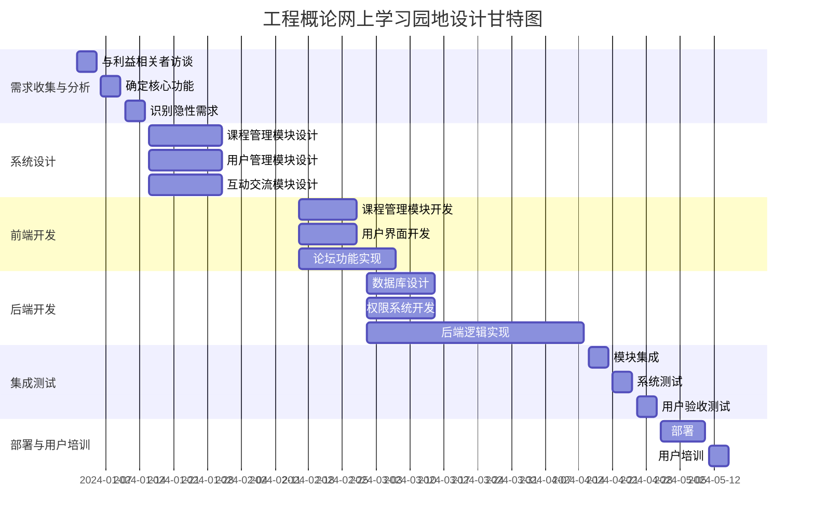

```mermaid
 
 
gantt
    dateFormat  YYYY-MM-DD
    title       工程概论网上学习园地设计甘特图
    section     需求收集与分析
        与利益相关者访谈    :2024-01-01, 2024-01-05
        确定核心功能        :2024-01-06, 2024-01-10
        识别隐性需求        :2024-01-11, 2024-01-15
    section     系统设计
        课程管理模块设计    :2024-01-16, 2024-01-31
        用户管理模块设计    :2024-01-16, 2024-01-31
        互动交流模块设计    :2024-01-16, 2024-01-31
    section     前端开发
        课程管理模块开发    :2024-02-16, 2024-02-28
        用户界面开发        :2024-02-16, 2024-02-28
        论坛功能实现        :2024-02-16, 2024-03-07
    section     后端开发
        数据库设计          :2024-03-01, 2024-03-15
        权限系统开发        :2024-03-01, 2024-03-15
        后端逻辑实现        :2024-03-01, 2024-04-15
    section     集成测试
        模块集成            :2024-04-16, 2024-04-20
        系统测试            :2024-04-21, 2024-04-25
        用户验收测试        :2024-04-26, 2024-04-30
    section     部署与用户培训
        部署                :2024-05-01, 2024-05-10
        用户培训            :2024-05-11, 2024-05-15
 
```